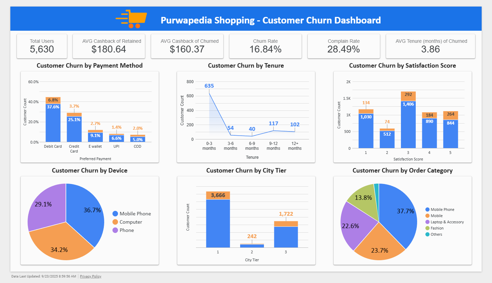
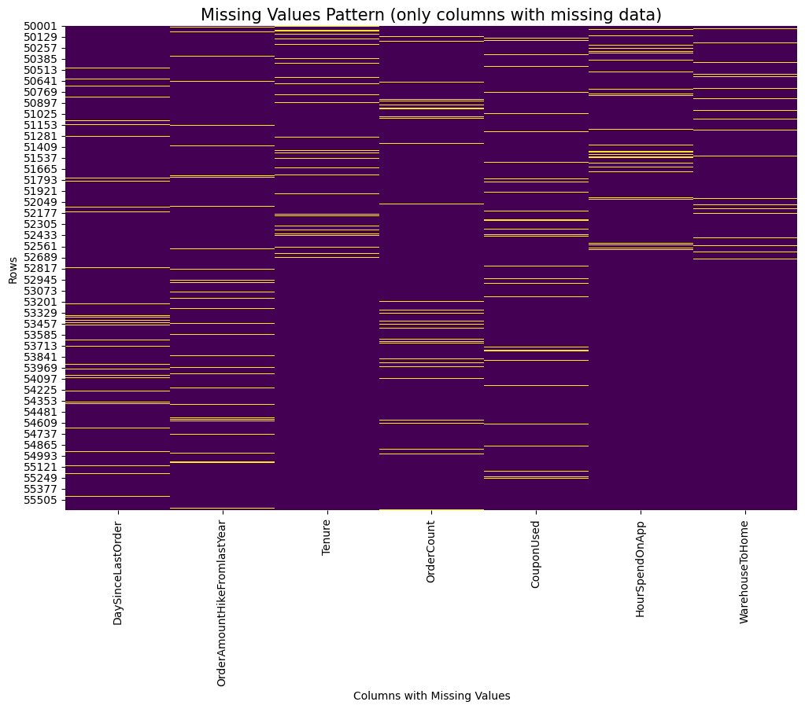
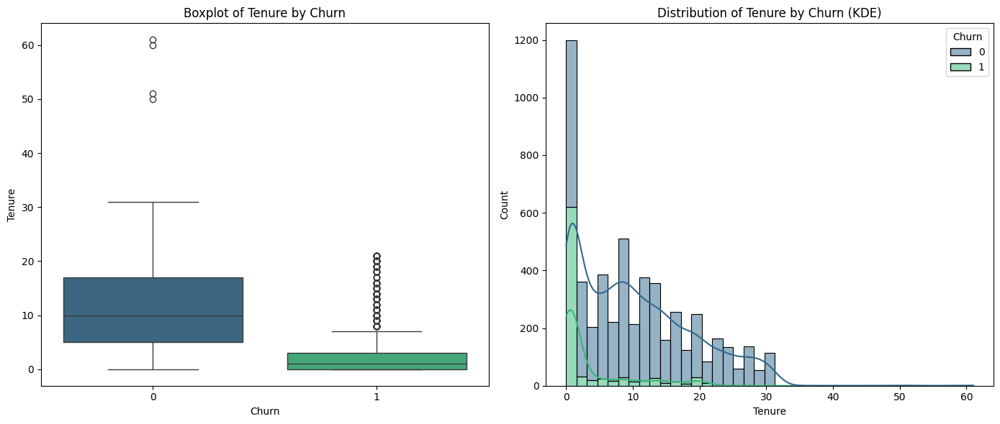
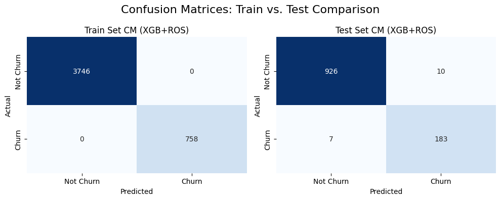
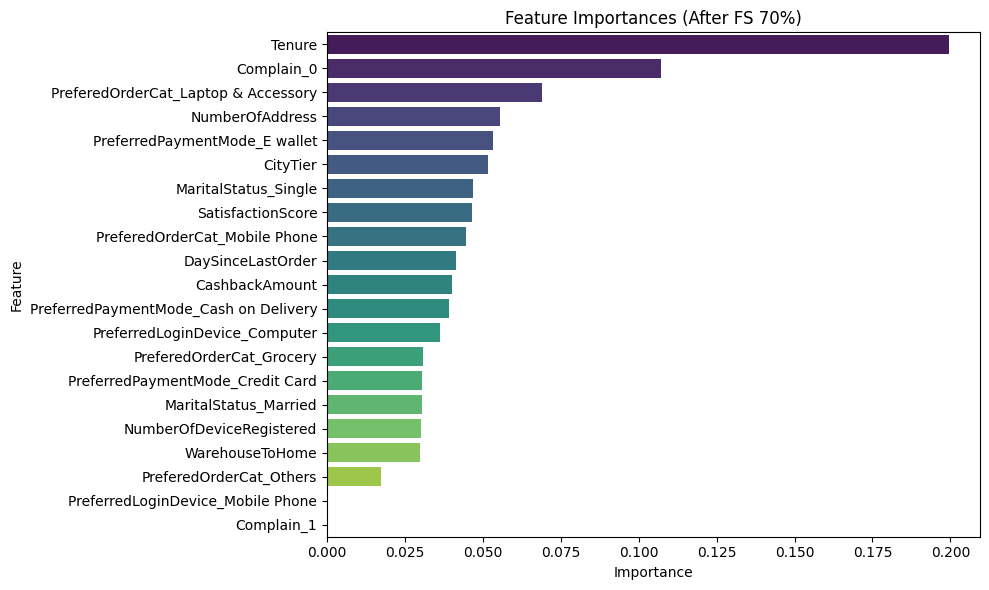
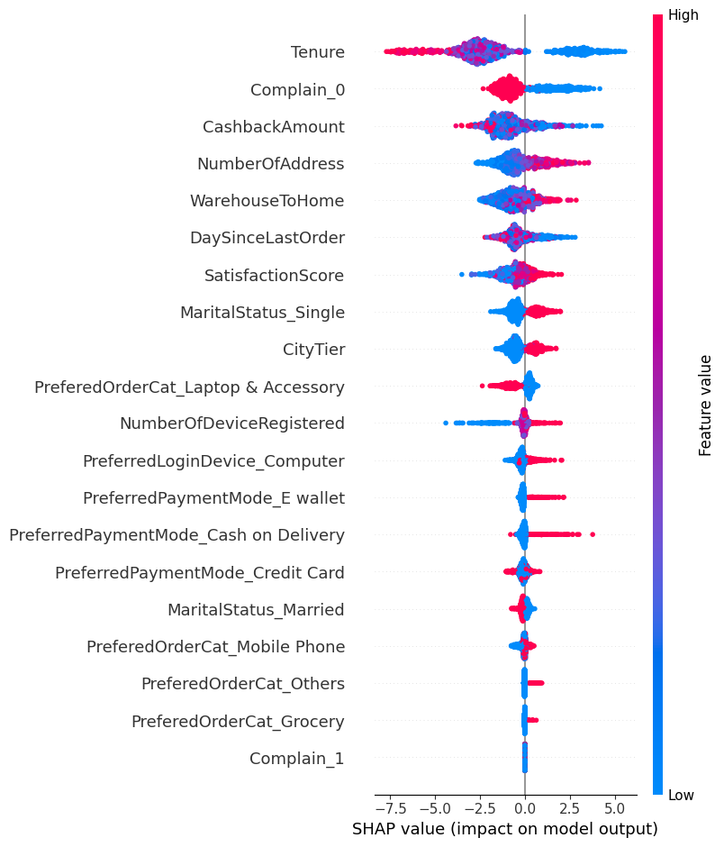
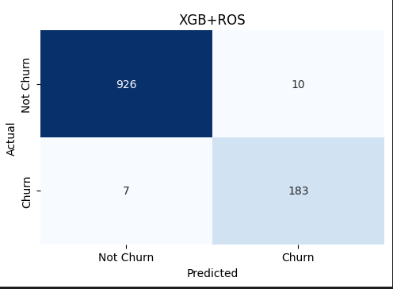

# Purwadhika JCDSOL19 - Final Project - Kelompok Alpha
- Hendra Ronaldi
- Dhiya Ilham Trihatmaja

# Purwapedia: Preventing Customer Churn with Machine Learning Prediction

- [Streamlit](https://ecommercecustomerchurn-alpha-jcdsol19.streamlit.app/)
- [Dashboard](https://lookerstudio.google.com/reporting/10509b68-b21c-4cd9-afe0-e264abbb2272/page/NO6YF)
- [Slide Presentation](https://drive.google.com/file/d/1bUQcHeSRuj3ZIugLBi4oC6jqDw0xDzd4/view)

## 📌 Business Problem Statement
Purwapedia is your smart & rewarding shopping companion. We offer curated products, fast PurwaExpress delivery, and a loyalty program (PurwaPoints) to make online shopping seamless and satisfying. Last month, we noticed a worrying trend. Out of 5,630 users, 16% (≈900 customers) stopped engaging with us. They are "churning", means leaving our platform for competitors. This is a signal that parts of our customer experience are failing.

The Kaggle dataset represents a **general e-commerce retail model**, where churn means customers became inactive. For this project, we **assume the dataset reflects one month of customer activity**. Under this assumption, the ~16% churn rate is far above healthy monthly benchmarks of **5–10%** seen in subscription-style e-commerce ([ScaleMath](https://scalemath.com/blog/what-is-a-good-monthly-churn-rate/?utm_source=chatgpt.com); [Opensend](https://www.opensend.com/post/churn-rate-ecommerce?utm_source=chatgpt.com)). 

This makes churn reduction a **serious business problem** and a strong candidate for predictive modeling and retention strategies.

---

## 🎯 Project Objectives
- Build a predictive model to **identify customers at risk of churn**.
- Enable **what-if scenario simulation** (e.g., improving satisfaction, resolving complaints).
- Provide **actionable recommendations** to reduce churn.
- Evaluate the **business impact** of churn reduction strategies.

---

## Evaluation Metrics

For this churn dataset, the following evaluation setup will be used:

1. **Main Metric → F2-Score**  
   - Prioritizes Recall 4× more than Precision, reflecting the fact that **acquiring a new customer is 5–25× more expensive than retaining an existing one** ([Harvard Business Review, 2014](https://hbr.org/2014/10/the-value-of-keeping-the-right-customers?utm_source=chatgpt.com)).  
   - This makes missing churners (false negatives) far more costly than mistakenly targeting loyal customers (false positives).  
   - Supported by churn prediction literature, where Recall-oriented metrics (e.g., F2) are recommended for imbalanced datasets ([Verbeke et al., 2012](https://doi.org/10.1016/j.dss.2012.05.005)).  

2. **Supporting Metric → ROC-AUC**  
   - Evaluates model discriminative power independent of thresholds.  
   - Widely used in churn research as a benchmark for classification quality.    

**Summary:**  
- **F2-Score** will be the headline evaluation metric.  
- **ROC-AUC** provides a threshold-independent comparison across models.

---

## Exploratory Data Analysis

Data columns (total 20 columns) & 5630 rows:

| # | Column Name | Non-Null Count | Data Type |
| :--- | :--- | :--- | :--- |
| 0 | CustomerID | 5630 | `int64` |
| 1 | Churn | 5630 | `int64` |
| 2 | Tenure | 5366 | `float64` |
| 3 | PreferredLoginDevice | 5630 | `object` |
| 4 | CityTier | 5630 | `int64` |
| 5 | WarehouseToHome | 5379 | `float64` |
| 6 | PreferredPaymentMode | 5630 | `object` |
| 7 | Gender | 5630 | `object` |
| 8 | HourSpendOnApp | 5375 | `float64` |
| 9 | NumberOfDeviceRegistered | 5630 | `int64` |
| 10 | PreferedOrderCat | 5630 | `object` |
| 11 | SatisfactionScore | 5630 | `int64` |
| 12 | MaritalStatus | 5630 | `object` |
| 13 | NumberOfAddress | 5630 | `int64` |
| 14 | Complain | 5630 | `int64` |
| 15 | OrderAmountHikeFromlastYear | 5365 | `float64` |
| 16 | CouponUsed | 5374 | `float64` |
| 17 | OrderCount | 5372 | `float64` |
| 18 | DaySinceLastOrder | 5323 | `float64` |
| 19 | CashbackAmount | 5630 | `float64` |

- Missing Values Exist

- Most of the numerical features are not normal distributed

---

## Methodology Analysis

### Preprocessing
- Stratified Train Test Split (Preventing Information Leakage)
- Imputer (Median) Numerical Features
- Robust Scaler
- OneHot Encoding
- Ordinal Encoding

### Benchmarking

**Feature Selection**
- Experiment show `70` percentile (from 31 to 21 features) perform good enough with globally all models show increasing cross validation mean evaluation F2 score until this point.

| Model                  | FS_50 (±)       | FS_60 (±)       | FS_70 (±)       | FS_80 (±)       | FS_90 (±)       | FS_100 (±)      |
| ---------------------- | --------------- | --------------- | --------------- | --------------- | --------------- | --------------- |
| LogisticRegression     | 0.4843 ± 0.0405 | 0.4782 ± 0.0604 | 0.5374 ± 0.0350 | 0.5628 ± 0.0479 | 0.5615 ± 0.0483 | 0.5636 ± 0.0562 |
| KNeighborsClassifier   | 0.5068 ± 0.0416 | 0.5269 ± 0.0424 | 0.5825 ± 0.0456 | 0.5921 ± 0.0356 | 0.6160 ± 0.0318 | 0.5617 ± 0.0227 |
| DecisionTreeClassifier | 0.7835 ± 0.0268 | 0.8120 ± 0.0159 | 0.8153 ± 0.0151 | 0.8229 ± 0.0153 | 0.8221 ± 0.0207 | 0.8002 ± 0.0270 |
| RandomForestClassifier | 0.7513 ± 0.0242 | 0.7944 ± 0.0165 | 0.8049 ± 0.0334 | 0.7972 ± 0.0328 | 0.8079 ± 0.0255 | 0.7875 ± 0.0373 |
| XGBClassifier          | 0.7941 ± 0.0350 | 0.8162 ± 0.0289 | 0.8298 ± 0.0260 | 0.8301 ± 0.0305 | 0.8460 ± 0.0234 | 0.8276 ± 0.0408 |

| Feature Selection Change | LogisticRegression | KNeighborsClassifier | DecisionTreeClassifier | RandomForestClassifier | XGBClassifier |
| ------------------------ | ------------------ | -------------------- | ---------------------- | ---------------------- | ------------- |
| 50 → 60                  | -0.0060            | 0.0201               | 0.0285                 | 0.0431                 | 0.0221        |
| 60 → 70                  | 0.0592             | 0.0555               | 0.0033                 | 0.0106                 | 0.0136        |
| 70 → 80                  | 0.0253             | 0.0096               | 0.0076                 | -0.0078                | 0.0002        |
| 80 → 90                  | -0.0012            | 0.0239               | -0.0008                | 0.0107                 | 0.0159        |
| 90 → 100                 | 0.0020             | -0.0543              | -0.0219                | -0.0204                | -0.0184       |

**Oversampling**
- With addition `70` percentile feature selection

| Model                  | FS_70_ROS (±)   | FS_70_SMOTE (±) |
| ---------------------- | --------------- | --------------- |
| LogisticRegression     | 0.6892 ± 0.0270 | 0.6760 ± 0.0345 |
| KNeighborsClassifier   | 0.8103 ± 0.0189 | 0.8168 ± 0.0091 |
| DecisionTreeClassifier | 0.7786 ± 0.0280 | 0.7829 ± 0.0450 |
| RandomForestClassifier | 0.8466 ± 0.0303 | 0.8165 ± 0.0254 |
| XGBClassifier          | 0.8640 ± 0.0250 | 0.8280 ± 0.0338 |

`XGBoostClassifier` and `RandomForestClassifier` perform better using `ROS` in the same feature selection `70` percentile compare to original and `SMOTE` oversampling.

`XGBoostClassifier` and `RandomForestClassifier`, feature selection `70` percentile and `ROS` are chosen for hyperparameter tuning.

### Hyperparameter Tuning
=== Cross-Validation F2 Score Summary (Mean ± Std) ===
| Experiment | CV F2 (Mean ± Std) |
| ---------- | ------------------ |
| XGB+ROS    | 0.8660 ± 0.0254    |
| RF+ROS     | 0.8560 ± 0.0259    |
✅ Best experiment based on CV F2: XGB+ROS (0.8660)

--- Final Results (Train vs. Test) for Best Model ---
| Metric   | XGB+ROS (Train) | XGB+ROS (Test) |
| -------- | --------------- | -------------- |
| F2-Score | 1.0000          | 0.9601         |
| ROC-AUC  | 1.0000          | 0.9983         |

- Best Model: `XGBClassifier` with `70` percentile feature selection and `Random Oversampling`
- Best Params: `{'model__learning_rate': 0.2, 'model__max_depth': 7, 'model__n_estimators': 200}`

This model performs very good with mean evaluation F2 score `0.866` and standard deviation `0.0254`. No overfit clearly shown by F2 score `1.0` train and `0.96` test, ROC AUC score `1.0` train and `0.998` test.

**Feature Importances**

## Conclusion
A high-performing **XGBoost** model is successfully developed to predict customer churn.  
Using a **SelectPercentile feature selection (70%)**, the number of features was reduced from **31 to 21** while maintaining strong model performance.  

The primary metric, **F2-Score**, which prioritizes recall (catching churners), remains excellent, with the feature-selected model achieving a score of **0.960**.  

✅ This demonstrates that the model is highly effective at identifying customers at risk of churning while operating with a more compact feature set.

***

* **Tenure:** This is the **most significant predictor** of churn. New customers (`low Tenure`) are far more likely to churn than long-term customers. This is a common pattern and suggests that the initial customer experience is critical.
* **Customer Complaints:** Having a complaint on file (`Complain_0`) is the **second most important factor** and a very strong indicator of churn risk. Customers who have complained are highly likely to leave.
* **Marital Status:** Being single (`MaritalStatus_Single`) is a notable predictor of churn, while being married has a smaller impact. This finding aligns with the observation that different customer demographics have different churn probabilities.
* **Order and Engagement Metrics:** Customers who receive bigger CashbackAmount are less likely to churn, while customers who show have more addresses and far distance are more likely to churn. The SatisfactionScore may not have clear measure in what context it is since the higher score seems more likely to churn (Satisfaction scores maybe measured not from purchase reviews, but from app reviews or customer service feedback).

## Recommendation Actions
* **Engage New Customers Early**
    * **Stakeholders:** Marketing Team, Product Manager
    * **Duration:** **90 days**
    * **Action:** Marketing crafts personalized content/offers; Product Manager manages in-app onboarding features.

* **Prioritize Complaint Resolution**
    * **Stakeholders:** Customer Support, Data Analytics Teams
    * **Duration:** **1-2 months**
    * **Action:** Customer Support implements a fast-track resolution system; Data Analytics monitors post-resolution satisfaction.

* **Boost Engagement for At-Risk Segments**
    * **Stakeholders:** Marketing Team, Data Analytics, Product Manager
    * **Duration:** **2-3 months**
    * **Action:** Data identifies dissatisfied/low-cashback users; Marketing designs loyalty campaigns; Product Manager prepares campaign features.

* **Develop Demographic-Specific Campaigns**
    * **Stakeholders:** Marketing, Data Analytics Teams
    * **Duration:** **2 months**
    * **Action:** Data designs demographic segmentation; Marketing creates and executes tailored campaigns (e.g., for single customers).

## Measurable Impact

### Assumptions for this Simulation 💰

We’ll calculate costs using the general formula:  

**Total Cost = (FP + TP) × CRC + FN × CAC**

* **Customer Retention Cost (CRC):** $17  
* **Customer Acquisition Cost (CAC):** $85 [Reference](https://www.upcounting.com/blog/average-ecommerce-customer-acquisition-cost?utm_source=chatgpt.com)   
* **Sample Size:** 1,126 customers  

---

### 1. Cost With Model (Best Pipeline Confusion Matrix)

- **TP = 183**  
- **FP = 10**  
- **FN = 7**  

**Calculation:**  
- (TP + FP) × CRC = (183 + 10) × 50 = 193 × 17 = **$3,281**  
- FN × CAC = 7 × 85 = **$595**  
- **Total Cost (With Model) = $3,281 + $595 = $3,876**  

---

### 2. Cost Without Model (Naive: Treat All as At-Risk)

- **TP = 190** (all churners)  
- **FP = 936** (all non-churners treated as at-risk)  
- **FN = 0**  

**Calculation:**  
- (TP + FP) × CRC = (190 + 936) × 17 = 1,126 × 17 = **$19,142**  
- FN × CAC = 0 × 85 = **$0**  
- **Total Cost (Without Model) = $19,142**  

---

### 3. Cost Comparison  

| Scenario         | Formula Applied                       | Total Cost |
|------------------|---------------------------------------|------------|
| **With Model**   | (TP + FP) × CRC + FN × CAC = 193×17 + 7×85 | **$3,876** |
| **Without Model**| (TP + FP) × CRC + FN × CAC = 1,126×17 + 0   | **$19,142** |
| **Savings**      | —                                     | **$15,266** |

---

✅ By deploying this model, the business reduces costs from **$19,142** down to **$3,876**, achieving a net saving of **$15,266** — which is roughly **79.7% lower cost** compared to the naive approach.
